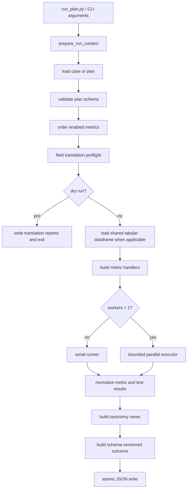

# Architecture

## Execution overview



## Major components

| Component | Responsibility |
| --- | --- |
| `run_plan.py` | Top-level orchestration and workflow sequencing. |
| `runner/io.py` | Distinguishes a case from a direct plan and resolves paths. |
| `runner/schema.py` | Validates plan structure before dataset loading. |
| `runner/run_context.py` | Prepares paths, metrics, taxonomy ordering, signal state, display configuration, and telemetry. |
| `runner/field_translation*.py` | Detects aliases, validates mappings, manages sidecars, decides runnable metrics, and emits reports. |
| `runner/dataset_loading.py` and `runner/tabular.py` | Load shared CSV, TSV, XLSX, or XLS data. |
| `runner/dispatch.py` | Maps metric IDs to callables and applies translated field configuration. |
| `runner/run_plan_serial.py` | Serial execution path. |
| `runner/execution.py` | Bounded parallel scheduling plus heartbeat/display helpers. |
| `runner/parallel_results.py` | Converts parallel return records to canonical outcome structures. |
| `runner/telemetry.py` | Central run, metric, and event state for display code. |
| `runner/taxonomy.py` | Builds plan, test-result, and execution-result taxonomy trees. |
| `runner/run_plan_helpers.py` | CLI parsing, signal handlers, headers, outcome construction, and atomic output writes. |
| `cbr_tests.metrics` | Production metric implementations already migrated out of the test package. |
| `tests/*_profile.py` and nested `tests/metrics/` | Remaining production metric implementations awaiting migration; pytest modules are specifically named `tests/test_*.py`. |

## Package boundary during refactoring

The target architecture keeps runtime metric implementations under `cbr_tests.metrics` and pytest code under `tests/test_*.py`. Compatibility modules such as `tests/pearson_profile.py` currently re-export migrated functions so existing callers do not break. Label, slice, reference-comparison, and nested network-realism implementations still live under `tests/` temporarily and are documented as production code despite their path.

## Metric dispatch contract

A metric handler is called with a dataset path and metric configuration. Most handlers return:

```python
(success: bool, payload: dict)
```

On successful tabular calculations, the payload commonly contains:

```json
{
  "test_results": {
    "metric_id": {}
  }
}
```

The dispatcher has three kinds of handlers:

1. registered packet/network handlers;
2. shared tabular compute functions;
3. special wrappers for correlation and quality profiles that also return column validation.

The current central registry is intentionally preserved for compatibility; modular metric definitions are planned after all implementations are moved into the production package.

## Field translation model

The internal mapping direction is dataset column to canonical field. User-facing files prefer `test_to_dataset_fields` for readability and are inverted during loading. Translation is applied recursively to `input_requirements` before dispatch. The dataframe itself is not renamed.

Preflight availability is based on:

- columns already named canonically;
- known aliases and tshark/Wireshark headings;
- explicit or sidecar mappings.

`field_requirements.required` determines whether a metric is runnable. Optional fields are diagnostic only.

## Serial execution

Serial execution runs one metric at a time through a one-worker heartbeat executor. It updates live telemetry, collects results, and observes cancellation between metrics. With `execution_policy.fail_fast: true`, the first execution-level failure stops later metrics.

## Parallel execution

Parallel execution uses a `ThreadPoolExecutor` with bounded submission: at most the configured worker count is outstanding. Each metric receives real start/finish timestamps and elapsed time.

Fail-fast behavior:

- the first completed execution failure prevents further submissions;
- queued futures are cancelled where possible;
- unsubmitted and successfully cancelled work is recorded as `not_run_fail_fast`;
- work already running is allowed to finish because Python cannot safely terminate threads.

Cancellation behavior:

- stops new submission;
- attempts to cancel queued futures;
- marks unfinished/unsubmitted work `not_run_cancelled`;
- requests non-blocking executor shutdown.

Results are sorted back into plan order before the outcome is assembled.

## Status model

There are two distinct layers:

### Execution status

Used in `metric_results` and top-level outcome decisions:

- `success`
- `failed`
- `skipped`
- `cancelled`
- `not_run_fail_fast`
- `not_run_cancelled`

### Domain status

Some metric payloads contain their own assessment:

- `pass`
- `warn`
- `fail`
- `not_applicable`

These domain statuses describe data realism or quality. They do not currently promote a successful handler call to an execution failure. Reporting and policy layers must inspect domain statuses separately.

## Outcome durability

Outcome JSON has `schema_version: 1`. The writer:

1. creates the destination directory;
2. writes to a temporary file in the same directory;
3. flushes and calls `fsync`;
4. replaces the destination with `os.replace`.

This minimizes partial or corrupt outcome files if a process is interrupted during writing.

## Performance characteristics

- A shared dataframe avoids re-reading large tabular data for each metric.
- Many handlers currently call `.copy()` before computing, which protects isolation but raises memory use.
- Tabular parallelism is capped at four workers.
- Distance correlation constructs full pairwise matrices and is quadratic in sample count.
- Energy distance and RBF MMD contain pairwise loops and are also potentially expensive; the first-half/second-half statistical metrics default to at most 1,000 observations per half.
- Reference-comparison functions currently load their own reference dataframe for each metric.

Resource policy and deterministic sampling are planned follow-up work.

## Telemetry and rendering

`RunState` is the central source for metric states, branch summaries, recent completions, and events. Compact and interactive rendering consume that model rather than inferring state independently. The full taxonomy renderer predates some of the telemetry path but uses the same status dictionaries.

## Test and documentation safeguards

CI runs source compilation and the full pytest suite on Python 3.11 and 3.12. Package-boundary tests ensure migrated metrics are imported from `cbr_tests.metrics`. Generated function and test references are checked against the AST so source changes cannot silently leave them stale.
